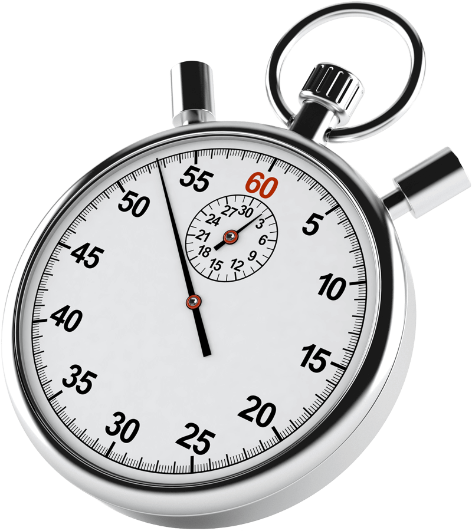

## Performance Insight

<a>
    
</a>

---

## In deze presentatie

- Meten is weten
- BenchmarkDotNet
- Profilers
- Vragen

---

## Meten is weten

- Gericht oplossen van problemen
- Performance is eigenlijk ook een feature
- Niet altijd duidelijk vanuit de code

--

## De dont's

- Debug mode
- Debugger

---

## Stopwatch

- Simpel
- Handig voor logging

```cs
Stopwatch stopWatch = new Stopwatch();
stopWatch.Start();
Thread.Sleep(10000);
stopWatch.Stop();
// Get the elapsed time as a TimeSpan value.
TimeSpan ts = stopWatch.Elapsed
// Format and display the TimeSpan value.
string elapsedTime = String.Format("{0:00}:{1:00}:{2:00}.{3:00}",
    ts.Hours, ts.Minutes, ts.Seconds,
    ts.Milliseconds / 10);
Console.WriteLine("RunTime " + elapsedTime);
```

--

## Stopwatch

- Geeft niet veel informatie
- Vergt code aanpassingen

---

## BenchmarkDotNet

- <https://benchmarkdotnet.org/>
- Helpt bij het maken van betrouwbare benchmarks
- Statistische analyse
- Nanoseconde precisie
- Grafieken

--

## BenchmarkDotNet

- Meer werk
- Niet toepasbaar in productie, zie het meer als een test

--

## Code

--

## Resultaten

<a>
    
</a>

--

## Grafiek

<a>
    
</a>

---

## Profilers

- Geven inzicht in zaken als CPU verbruik, geheugen verbruik en meer.
- In vele soorten en maten

--

## DotTrace

- CPU profiler
- <https://www.jetbrains.com/profiler/>


--

## Voorbeeld

--

## DotMemory

- Memory profiler
- <https://www.jetbrains.com/dotmemory/>


--

## Voorbeeld

---

## Vragen
